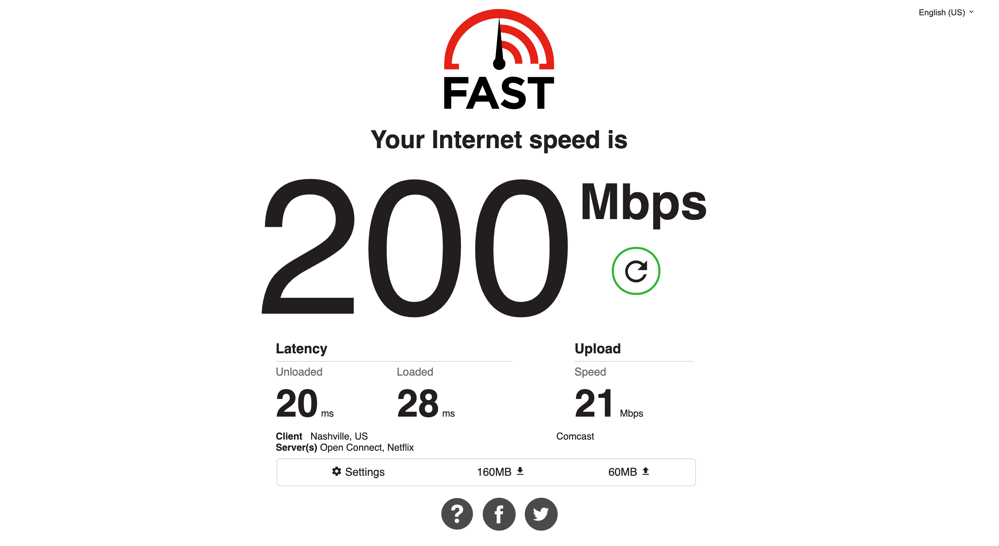

# Comcast Speed Test Results (Nashville)

## Common Speed Tests

#### Fast.com 1


#### Fast.com 2


#### Speedtest.net 1


#### Speedtest.net 2


## DNS Speed Test

[Script source](https://serverfault.com/a/618271/146329)

```
> ./dns-speed-test.sh dns-servers.txt 20
8.8.8.8         average    25     min    21     max    40 ms 20 responses
1.1.1.1         average    11     min    10     max    14 ms 20 responses
208.67.222.222  average    16     min    16     max    19 ms 20 responses
75.75.75.75     average    11     min     9     max    18 ms 20 responses
```

```
> ./dns-speed-test.sh dns-servers.txt 20
8.8.8.8         average    26     min    21     max    41 ms 20 responses
1.1.1.1         average    11     min     9     max    19 ms 20 responses
208.67.222.222  average    18     min    16     max    36 ms 20 responses
75.75.75.75     average    10     min     9     max    13 ms 20 responses
```

## Pings

```
> ping www.google.com
PING www.google.com (108.177.122.105): 56 data bytes
64 bytes from 108.177.122.105: icmp_seq=0 ttl=108 time=28.024 ms
64 bytes from 108.177.122.105: icmp_seq=1 ttl=108 time=27.413 ms
64 bytes from 108.177.122.105: icmp_seq=2 ttl=108 time=28.539 ms
64 bytes from 108.177.122.105: icmp_seq=3 ttl=108 time=29.190 ms
64 bytes from 108.177.122.105: icmp_seq=4 ttl=108 time=28.414 ms
^C
--- www.google.com ping statistics ---
5 packets transmitted, 5 packets received, 0.0% packet loss
round-trip min/avg/max/stddev = 27.413/28.316/29.190/0.587 ms
```

```
> ping 8.8.8.8
PING 8.8.8.8 (8.8.8.8): 56 data bytes
64 bytes from 8.8.8.8: icmp_seq=0 ttl=118 time=21.760 ms
64 bytes from 8.8.8.8: icmp_seq=1 ttl=118 time=22.485 ms
64 bytes from 8.8.8.8: icmp_seq=2 ttl=118 time=22.564 ms
64 bytes from 8.8.8.8: icmp_seq=3 ttl=118 time=24.480 ms
64 bytes from 8.8.8.8: icmp_seq=4 ttl=118 time=21.789 ms
^C
--- 8.8.8.8 ping statistics ---
5 packets transmitted, 5 packets received, 0.0% packet loss
round-trip min/avg/max/stddev = 21.760/22.616/24.480/0.991 ms
```

```
> ping 1.1.1.1
PING 1.1.1.1 (1.1.1.1): 56 data bytes
64 bytes from 1.1.1.1: icmp_seq=0 ttl=60 time=11.140 ms
64 bytes from 1.1.1.1: icmp_seq=1 ttl=60 time=9.706 ms
64 bytes from 1.1.1.1: icmp_seq=2 ttl=60 time=9.806 ms
64 bytes from 1.1.1.1: icmp_seq=3 ttl=60 time=10.325 ms
64 bytes from 1.1.1.1: icmp_seq=4 ttl=60 time=11.108 ms
^C
--- 1.1.1.1 ping statistics ---
5 packets transmitted, 5 packets received, 0.0% packet loss
round-trip min/avg/max/stddev = 9.706/10.417/11.140/0.614 ms
```

```
> ping registry.yarnpkg.com
PING yarn.npmjs.org (104.16.27.35): 56 data bytes
64 bytes from 104.16.27.35: icmp_seq=0 ttl=60 time=18.281 ms
64 bytes from 104.16.27.35: icmp_seq=1 ttl=60 time=10.687 ms
64 bytes from 104.16.27.35: icmp_seq=2 ttl=60 time=9.991 ms
64 bytes from 104.16.27.35: icmp_seq=3 ttl=60 time=11.258 ms
64 bytes from 104.16.27.35: icmp_seq=4 ttl=60 time=12.390 ms
^C
--- yarn.npmjs.org ping statistics ---
5 packets transmitted, 5 packets received, 0.0% packet loss
round-trip min/avg/max/stddev = 9.991/12.521/18.281/2.985 ms
```

```
> ping registry.npmjs.org                                                                                                                                                   
PING registry.npmjs.org (104.16.19.35): 56 data bytes
64 bytes from 104.16.19.35: icmp_seq=0 ttl=60 time=10.249 ms
64 bytes from 104.16.19.35: icmp_seq=1 ttl=60 time=10.757 ms
64 bytes from 104.16.19.35: icmp_seq=2 ttl=60 time=9.559 ms
64 bytes from 104.16.19.35: icmp_seq=3 ttl=60 time=11.283 ms
64 bytes from 104.16.19.35: icmp_seq=4 ttl=60 time=11.299 ms
^C
--- registry.npmjs.org ping statistics ---
5 packets transmitted, 5 packets received, 0.0% packet loss
round-trip min/avg/max/stddev = 9.559/10.629/11.299/0.661 ms
```

```
> ping github.com
PING github.com (140.82.112.4): 56 data bytes
64 bytes from 140.82.112.4: icmp_seq=0 ttl=52 time=34.485 ms
64 bytes from 140.82.112.4: icmp_seq=1 ttl=52 time=34.708 ms
64 bytes from 140.82.112.4: icmp_seq=2 ttl=52 time=34.916 ms
64 bytes from 140.82.112.4: icmp_seq=3 ttl=52 time=41.926 ms
64 bytes from 140.82.112.4: icmp_seq=4 ttl=52 time=34.833 ms
^C
--- github.com ping statistics ---
5 packets transmitted, 5 packets received, 0.0% packet loss
round-trip min/avg/max/stddev = 34.485/36.174/41.926/2.880 ms
```

```
> ping cdnjs.cloudflare.com
PING cdnjs.cloudflare.com (104.16.133.229): 56 data bytes
64 bytes from 104.16.133.229: icmp_seq=0 ttl=60 time=11.188 ms
64 bytes from 104.16.133.229: icmp_seq=1 ttl=60 time=9.728 ms
64 bytes from 104.16.133.229: icmp_seq=2 ttl=60 time=10.614 ms
64 bytes from 104.16.133.229: icmp_seq=3 ttl=60 time=10.322 ms
64 bytes from 104.16.133.229: icmp_seq=4 ttl=60 time=11.486 ms
^C
--- cdnjs.cloudflare.com ping statistics ---
5 packets transmitted, 5 packets received, 0.0% packet loss
round-trip min/avg/max/stddev = 9.728/10.668/11.486/0.624 ms
```

```
> ping cdn.jsdelivr.net
PING cdn.jsdelivr.net.cdn.cloudflare.net (104.16.89.20): 56 data bytes
64 bytes from 104.16.89.20: icmp_seq=0 ttl=60 time=11.041 ms
64 bytes from 104.16.89.20: icmp_seq=1 ttl=60 time=10.620 ms
64 bytes from 104.16.89.20: icmp_seq=2 ttl=60 time=9.779 ms
64 bytes from 104.16.89.20: icmp_seq=3 ttl=60 time=11.471 ms
64 bytes from 104.16.89.20: icmp_seq=4 ttl=60 time=9.808 ms
^C
--- cdn.jsdelivr.net.cdn.cloudflare.net ping statistics ---
5 packets transmitted, 5 packets received, 0.0% packet loss
round-trip min/avg/max/stddev = 9.779/10.544/11.471/0.669 ms
```

```
> ping user-images.githubusercontent.com
PING github.map.fastly.net (151.101.0.133): 56 data bytes
64 bytes from 151.101.0.133: icmp_seq=0 ttl=58 time=22.502 ms
64 bytes from 151.101.0.133: icmp_seq=1 ttl=58 time=21.791 ms
64 bytes from 151.101.0.133: icmp_seq=2 ttl=58 time=22.128 ms
64 bytes from 151.101.0.133: icmp_seq=3 ttl=58 time=22.671 ms
64 bytes from 151.101.0.133: icmp_seq=4 ttl=58 time=22.283 ms
^C
--- github.map.fastly.net ping statistics ---
5 packets transmitted, 5 packets received, 0.0% packet loss
round-trip min/avg/max/stddev = 21.791/22.275/22.671/0.305 ms
```

```
> ping d1.awsstatic.com
PING d1.awsstatic.com (13.249.126.194): 56 data bytes
64 bytes from 13.249.126.194: icmp_seq=0 ttl=245 time=31.104 ms
64 bytes from 13.249.126.194: icmp_seq=1 ttl=245 time=28.828 ms
64 bytes from 13.249.126.194: icmp_seq=2 ttl=245 time=29.999 ms
64 bytes from 13.249.126.194: icmp_seq=3 ttl=245 time=29.363 ms
64 bytes from 13.249.126.194: icmp_seq=4 ttl=245 time=37.731 ms
^C
--- d1.awsstatic.com ping statistics ---
5 packets transmitted, 5 packets received, 0.0% packet loss
round-trip min/avg/max/stddev = 28.828/31.405/37.731/3.253 ms
```
