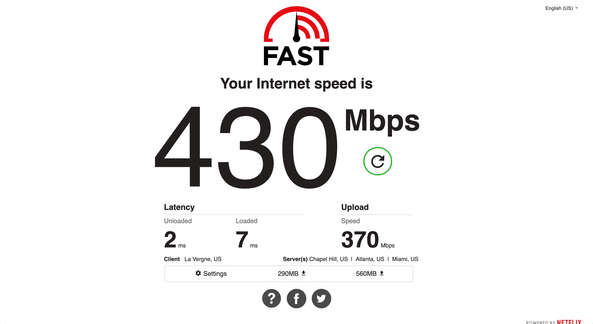
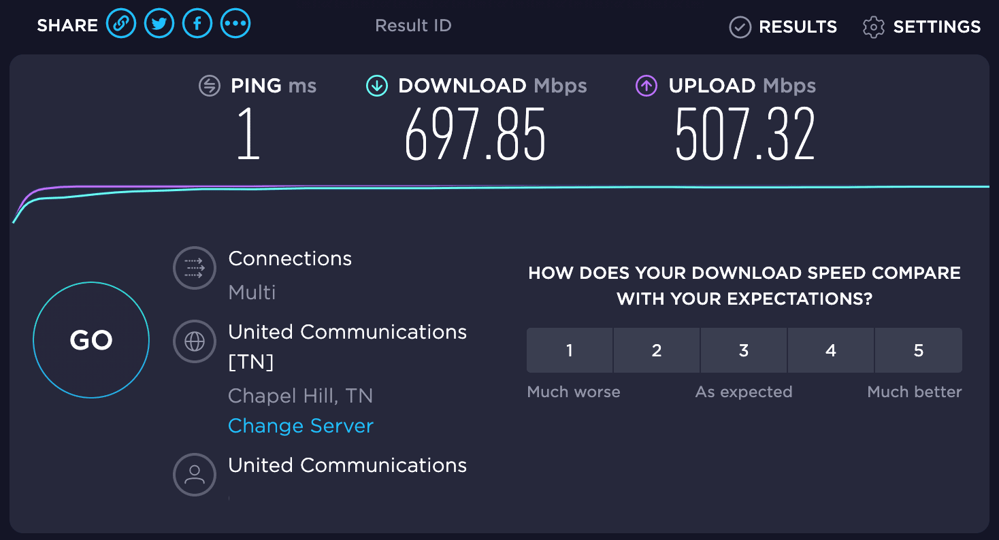
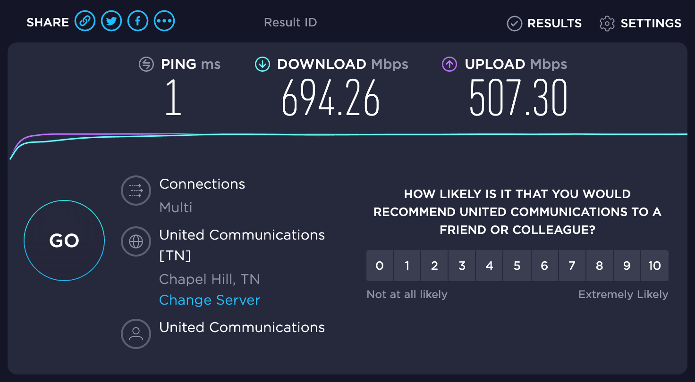

# United Communications Speed Test Results (Nashville)

## Common Speed Tests

#### Fast.com 1


#### Fast.com 2


#### Speedtest.net 1


#### Speedtest.net 2


## DNS Speed Test

[Script source](https://serverfault.com/a/618271/146329)

```
> ./dns-speed-test.sh dns-servers.txt 20
8.8.8.8         average     8     min     8     max     9 ms 20 responses
1.1.1.1         average     8     min     7     max     9 ms 20 responses
208.67.222.222  average     8     min     8     max     8 ms 20 responses
75.75.75.75     average     9     min     9     max    10 ms 20 responses
74.51.13.2      average     2     min     2     max     2 ms 20 responses
```

```
> ./dns-speed-test.sh dns-servers.txt 20
8.8.8.8         average     8     min     8     max     9 ms 20 responses
1.1.1.1         average     8     min     8     max     9 ms 20 responses
208.67.222.222  average     8     min     8     max     8 ms 20 responses
75.75.75.75     average     9     min     9     max    10 ms 20 responses
74.51.13.2      average     2     min     2     max     5 ms 20 responses
```

## Pings

```
> ping www.google.com
PING www.google.com (172.253.124.105): 56 data bytes
64 bytes from 172.253.124.105: icmp_seq=0 ttl=107 time=8.809 ms
64 bytes from 172.253.124.105: icmp_seq=1 ttl=107 time=8.819 ms
64 bytes from 172.253.124.105: icmp_seq=2 ttl=107 time=8.810 ms
64 bytes from 172.253.124.105: icmp_seq=3 ttl=107 time=8.745 ms
64 bytes from 172.253.124.105: icmp_seq=4 ttl=107 time=8.890 ms
^C
--- www.google.com ping statistics ---
5 packets transmitted, 5 packets received, 0.0% packet loss
round-trip min/avg/max/stddev = 8.745/8.815/8.890/0.046 ms
```

```
> ping 8.8.8.8
PING 8.8.8.8 (8.8.8.8): 56 data bytes
64 bytes from 8.8.8.8: icmp_seq=0 ttl=115 time=8.985 ms
64 bytes from 8.8.8.8: icmp_seq=1 ttl=115 time=8.841 ms
64 bytes from 8.8.8.8: icmp_seq=2 ttl=115 time=8.922 ms
64 bytes from 8.8.8.8: icmp_seq=3 ttl=115 time=8.891 ms
64 bytes from 8.8.8.8: icmp_seq=4 ttl=115 time=8.774 ms
^C
--- 8.8.8.8 ping statistics ---
5 packets transmitted, 5 packets received, 0.0% packet loss
round-trip min/avg/max/stddev = 8.774/8.883/8.985/0.072 ms
```

```
> ping 1.1.1.1
PING 1.1.1.1 (1.1.1.1): 56 data bytes
64 bytes from 1.1.1.1: icmp_seq=0 ttl=57 time=8.442 ms
64 bytes from 1.1.1.1: icmp_seq=1 ttl=57 time=8.532 ms
64 bytes from 1.1.1.1: icmp_seq=2 ttl=57 time=8.490 ms
64 bytes from 1.1.1.1: icmp_seq=3 ttl=57 time=8.590 ms
64 bytes from 1.1.1.1: icmp_seq=4 ttl=57 time=8.447 ms
^C
--- 1.1.1.1 ping statistics ---
5 packets transmitted, 5 packets received, 0.0% packet loss
round-trip min/avg/max/stddev = 8.442/8.500/8.590/0.055 ms
```

```
> ping registry.yarnpkg.com
PING yarn.npmjs.org (104.16.22.35): 56 data bytes
64 bytes from 104.16.22.35: icmp_seq=0 ttl=57 time=8.494 ms
64 bytes from 104.16.22.35: icmp_seq=1 ttl=57 time=8.545 ms
64 bytes from 104.16.22.35: icmp_seq=2 ttl=57 time=8.431 ms
64 bytes from 104.16.22.35: icmp_seq=3 ttl=57 time=8.711 ms
64 bytes from 104.16.22.35: icmp_seq=4 ttl=57 time=8.481 ms
^C
--- yarn.npmjs.org ping statistics ---
5 packets transmitted, 5 packets received, 0.0% packet loss
round-trip min/avg/max/stddev = 8.431/8.532/8.711/0.096 ms
```

```
> ping registry.npmjs.org
PING registry.npmjs.org (104.16.18.35): 56 data bytes
64 bytes from 104.16.18.35: icmp_seq=0 ttl=57 time=8.435 ms
64 bytes from 104.16.18.35: icmp_seq=1 ttl=57 time=8.715 ms
64 bytes from 104.16.18.35: icmp_seq=2 ttl=57 time=8.469 ms
64 bytes from 104.16.18.35: icmp_seq=3 ttl=57 time=8.453 ms
64 bytes from 104.16.18.35: icmp_seq=4 ttl=57 time=8.307 ms
^C
--- registry.npmjs.org ping statistics ---
5 packets transmitted, 5 packets received, 0.0% packet loss
round-trip min/avg/max/stddev = 8.307/8.476/8.715/0.133 ms
```

```
> ping github.com
PING github.com (140.82.113.4): 56 data bytes
64 bytes from 140.82.113.4: icmp_seq=0 ttl=53 time=21.472 ms
64 bytes from 140.82.113.4: icmp_seq=1 ttl=53 time=21.640 ms
64 bytes from 140.82.113.4: icmp_seq=2 ttl=53 time=21.355 ms
64 bytes from 140.82.113.4: icmp_seq=3 ttl=53 time=21.387 ms
64 bytes from 140.82.113.4: icmp_seq=4 ttl=53 time=21.250 ms
^C
--- github.com ping statistics ---
5 packets transmitted, 5 packets received, 0.0% packet loss
round-trip min/avg/max/stddev = 21.250/21.421/21.640/0.131 ms
```

```
> ping cdnjs.cloudflare.com
PING cdnjs.cloudflare.com (104.16.132.229): 56 data bytes
64 bytes from 104.16.132.229: icmp_seq=0 ttl=57 time=8.443 ms
64 bytes from 104.16.132.229: icmp_seq=1 ttl=57 time=8.680 ms
64 bytes from 104.16.132.229: icmp_seq=2 ttl=57 time=8.647 ms
64 bytes from 104.16.132.229: icmp_seq=3 ttl=57 time=8.595 ms
64 bytes from 104.16.132.229: icmp_seq=4 ttl=57 time=8.665 ms
^C
--- cdnjs.cloudflare.com ping statistics ---
5 packets transmitted, 5 packets received, 0.0% packet loss
round-trip min/avg/max/stddev = 8.443/8.606/8.680/0.086 ms
```

```
> ping cdn.jsdelivr.net
PING cdn.jsdelivr.net.cdn.cloudflare.net (104.16.89.20): 56 data bytes
64 bytes from 104.16.89.20: icmp_seq=0 ttl=57 time=8.615 ms
64 bytes from 104.16.89.20: icmp_seq=1 ttl=57 time=8.567 ms
64 bytes from 104.16.89.20: icmp_seq=2 ttl=57 time=8.436 ms
64 bytes from 104.16.89.20: icmp_seq=3 ttl=57 time=8.561 ms
64 bytes from 104.16.89.20: icmp_seq=4 ttl=57 time=8.434 ms
^C
--- cdn.jsdelivr.net.cdn.cloudflare.net ping statistics ---
5 packets transmitted, 5 packets received, 0.0% packet loss
round-trip min/avg/max/stddev = 8.434/8.523/8.615/0.074 ms
```

```
> ping user-images.githubusercontent.com
PING github.map.fastly.net (151.101.0.133): 56 data bytes
64 bytes from 151.101.0.133: icmp_seq=0 ttl=59 time=7.509 ms
64 bytes from 151.101.0.133: icmp_seq=1 ttl=59 time=7.469 ms
64 bytes from 151.101.0.133: icmp_seq=2 ttl=59 time=7.668 ms
64 bytes from 151.101.0.133: icmp_seq=3 ttl=59 time=7.514 ms
64 bytes from 151.101.0.133: icmp_seq=4 ttl=59 time=7.617 ms
^C
--- github.map.fastly.net ping statistics ---
5 packets transmitted, 5 packets received, 0.0% packet loss
round-trip min/avg/max/stddev = 7.469/7.555/7.668/0.075 ms
```

```
> ping d1.awsstatic.com
PING d1.awsstatic.com (54.230.248.133): 56 data bytes
64 bytes from 54.230.248.133: icmp_seq=0 ttl=235 time=8.615 ms
64 bytes from 54.230.248.133: icmp_seq=1 ttl=235 time=8.668 ms
64 bytes from 54.230.248.133: icmp_seq=2 ttl=235 time=8.575 ms
64 bytes from 54.230.248.133: icmp_seq=3 ttl=235 time=8.669 ms
64 bytes from 54.230.248.133: icmp_seq=4 ttl=235 time=8.626 ms
^C
--- d1.awsstatic.com ping statistics ---
5 packets transmitted, 5 packets received, 0.0% packet loss
round-trip min/avg/max/stddev = 8.575/8.631/8.669/0.035 ms
```
